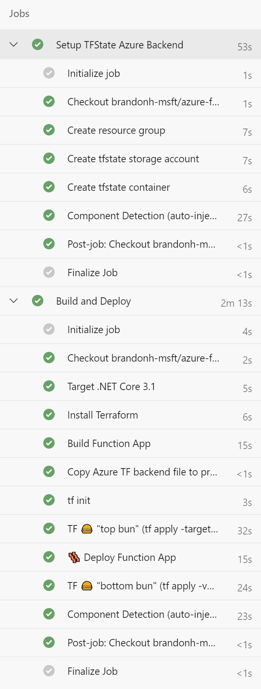
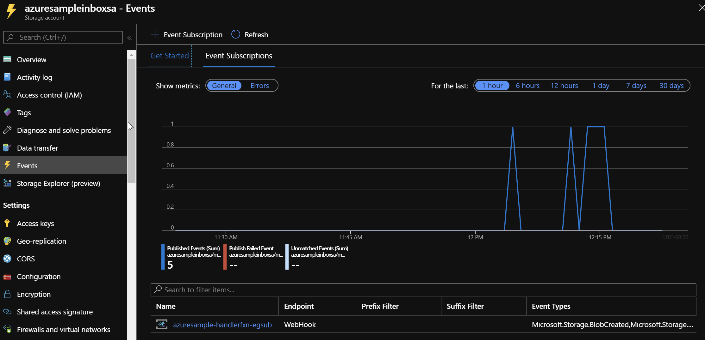
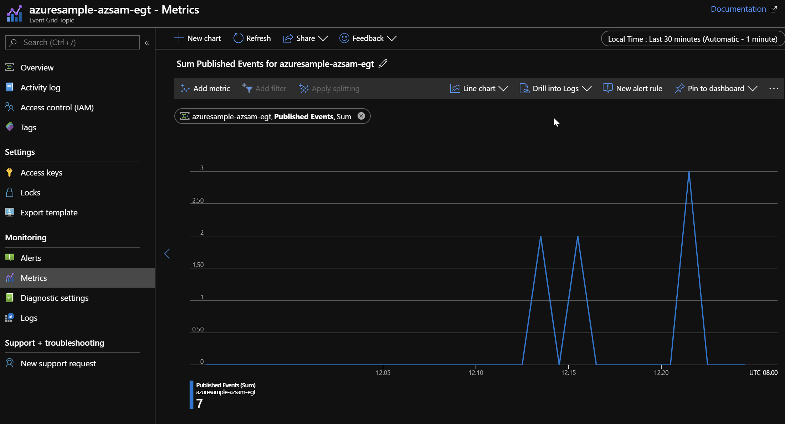
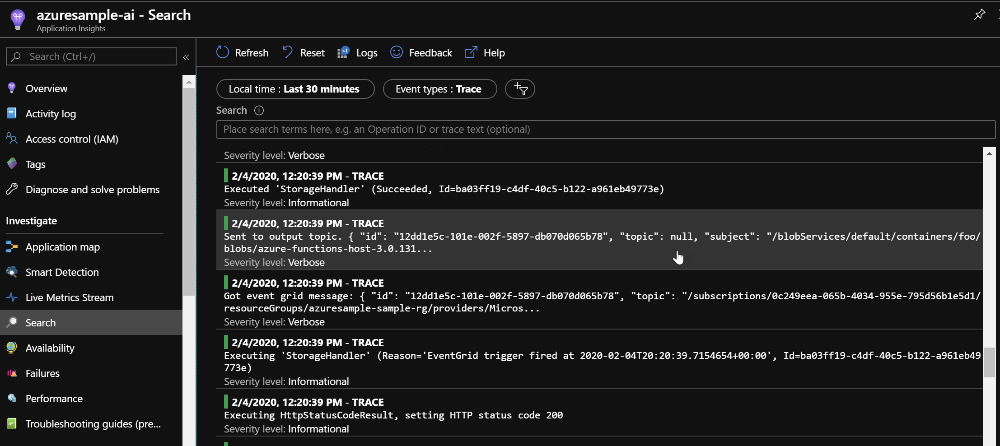

# Subscribing an Azure Function to Event Grid Events via Terraform

This sample will show you how to create Terraform scripts that create an Azure Function and Subscribe it to Event Grid Storage events.
This is especially interesting as, for Event Grid Subscriptions, the target endpoint must answer EG's "[Subscription Validation Event](https://docs.microsoft.com/en-us/azure/event-grid/security-authentication#validation-details)" which it cannot do until it is deployed. So this method - affectionally coined a "Terraform Sandwich" - shows how to do just that.

## Deploying locally

1. Open the repo in its VS Code Dev Container (this ensures you have all the right versions of the necessary tooling)
1. run `./deploy.sh <target subscription id> <unique prefix>`

### What it does

- Logs in to Azure and connects to the target subscription
- Tells terraform to deploy everything **except** the event grid subscription piece
- Deploys the function app out to Azure so it's ready to answer the subscription wire-up that Terraform will do next
- Tells terraform to deploy **everything**, which issues the necessary changes to Azure to add the event grid subscription to an 'inbox' storage account

## Deploying via Azure DevOps

By importing the [azure-piplines.yaml](./azure-pipelines.yaml) file in to an Azure DevOps pipeline, you'll get the same process as the above local execution.
> Note: Be sure to change [the `PREFIX` variable](./azure-pipelines.yml#L10) to something unique to you to avoid naming collisions on storage & function apps

You'll need to create a Service Connection in Azure DevOps:

1. Click **Project settings** (bottom left)
1. Click **Service connections**
1. Click **Create service connection**
1. Select **Azure Resource Manager**
1. Select **Service Principal (automatic)**
1. Enter **Service Connection name** `my-azure` (Note: you can leave **Resource group** blank)
1. Ensure **Grant access permissions to all pipelines** is checked

Run the pipeline:

## Running the sample

This sample has an Azure Function that subscribes to Blob Storage Events and then simply passes the event on to a custom Event Grid Topic. The receiving and sending of events is accomplished via the Event Grid Binding for Azure Functions.

To exercise the sample:

1. Open the 'inbox' storage account created by the deployment
1. Create a new container
1. Upload a file in to the container

Next, go to the Azure Portal, and the  Storage Account created by the deployment. Click the 'Events' area and you will see one or more events have come through:

Then go to the custom topic created by deployment, and you'll see that one or more events have been posted to it:

Finally, if you wish to see the output from the Function, go to the Application Insights resource created by deployment and look through the logged TRACE events:

